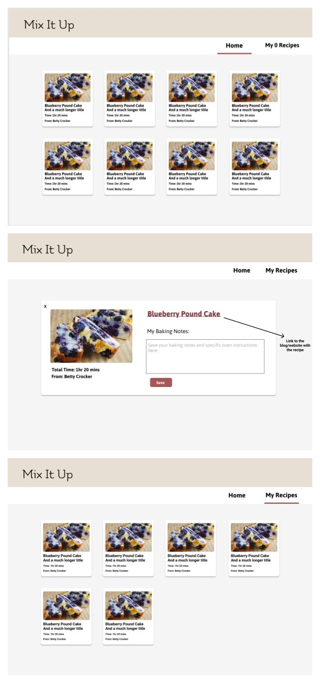

# Mix It Up 
Mix It Up is a recipe app for bakers. Users can save links to recipes as well as personalized notes with their ingredient and cook time adjustments for those recipes.

### Set-Up: 
Clone this repo  
Run `npm install` from the root directory  
Run `npm start` and visit localhost:3000 in your browser  

### Preview:
  
### Primary Technologies Used:
* React 
* Redux
* React Router
* JavaScript
* SCSS

### Testing:
Jest and Enzyme for testing  
Run `npm test` from the root directory  

### Original Assignment: 
[Binary Challenge](http://frontend.turing.io/projects/binary-challenge.html) from Turing School of Software & Design  

### Wireframes:

This project was bootstrapped with [Create React App](https://github.com/facebook/create-react-app).